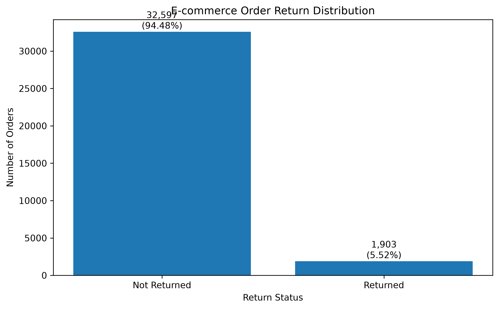
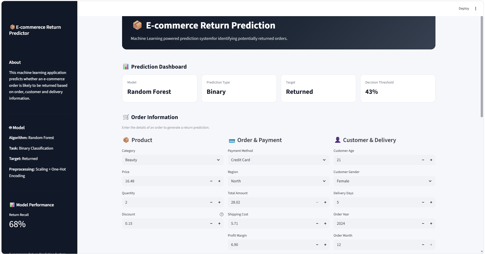

# E-Commerce_Return_Prediction_System

This is a machine learning project where I tried to predict whether an e-commerce order will be returned or not.

I worked on the project from data cleaning to model training and finally created a Streamlit app where we can enter order details and get a prediction.

## About the Dataset

The dataset contains 34,500 orders and 19 columns.

Some of the columns include:

- Category                       - Price
- Discount                       - Quantity
- Payment Method                 - Region
- Order Date                     - Delivered Date
- Returned                       - Total Amount
- Shipping Cost                  - Profit Margin
- Customer Age                   - Customer Gender

The main column I wanted to predict was returned.

returned = 0  (means the order was not returned.)

returned = 1  (means the order was returned.)

## One of the main problems: Class Imbalance

When I checked the target variable, I found that the data was highly imbalanced.
There were 32,597 orders that were not returned and only 1,903 orders that were returned.

| Returned | Number of Orders | Percentage |
| -------- | ---------------- | ---------- |
| No (0)   |           32,597 |     94.48% |
| Yes (1)  |            1,903 |      5.52% |

So, almost 95% of the data belongs to the "Not Returned" class.

This is important because a model can get very high accuracy just by predicting most orders as "Not Returned". But that would not be useful because the main thing we want to identify is the returned orders.

For this reason, I mainly looked at F1 score, precision, recall and the confusion matrix instead of only looking at accuracy.

### Target Distribution

I used the following plot to understand the imbalance:

The plot makes the imbalance much easier to see.

### App Dashboard

## Data Cleaning

I first checked the dataset for missing values and duplicate rows.

There were no duplicate rows.

The main missing values were in `request_date` and `return_reason`.

I did not use these columns for prediction because they are related to the return process and could cause data leakage.

I also converted the date information into useful features such as:

- Order year
- Order month
- Order day of week
- Delivery days

I removed columns such as order ID, customer ID and product ID because they were identifiers rather than useful prediction features.

## Feature Engineering

I created a few additional features from the existing columns.

- price_per_quantity
- amount_per_quantity
- shipping_ratio
- profit_amount

## Author

**Sarthak Singh**

If you have any suggestions or feedback, I'd be happy to hear them. Every project is an opportunity to learn something new, and this taught me a lot about the complete data analysis process.
